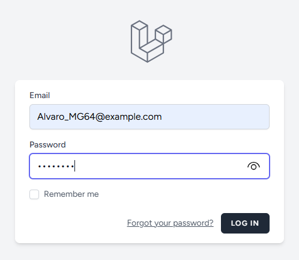
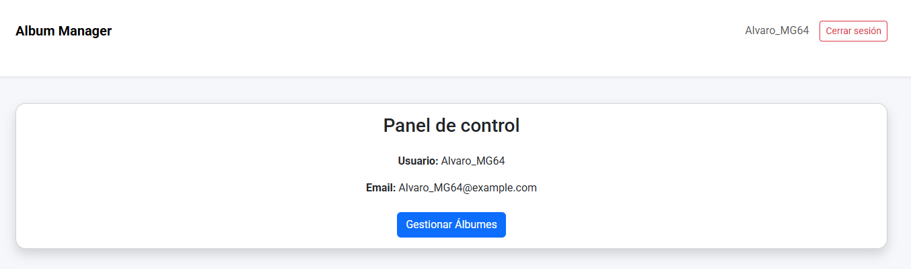

# 🎵 AlbumManagerLaravel

Proyecto de gestión de álbumes musicales desarrollado con **Laravel 12**, utilizando **Laravel Breeze** para la autenticación y **MySQL** como base de datos.

El sistema permite:

- Autenticación de usuarios (login / logout)
- Acceso a un dashboard protegido
- Gestión completa de álbumes (listar, crear, editar, eliminar)
- Diseño responsive con Bootstrap y tipografía Roboto

---

## 🚀 Tecnologías utilizadas

- PHP 8.2+
- Laravel 12
- Laravel Breeze (Blade)
- MySQL
- Bootstrap 5
- Google Fonts (Roboto)

---

## 🔐 Autenticación (Laravel Breeze)

El proyecto utiliza **Laravel Breeze con Blade** para el sistema de login.

### Características

- Login protegido por middleware `auth`
- Logout redirige correctamente al formulario de login
- Gestión de sesiones con Laravel
- Vistas estándar de Breeze (`resources/views/auth`)

---

## 🔄 Flujo de autenticación

1. Acceso a `/login`
2. Login correcto
3. Redirección automática a `/dashboard`
4. Desde el dashboard se puede:
   - Acceder a álbumes
   - Cerrar sesión (logout → `/login`)

---

## 🧭 Estructura de navegación

| URL | Descripción |
|-----|-------------|
| `/login` | Formulario de login |
| `/dashboard` | Panel principal |
| `/albums` | Listado de álbumes |
| `/albums/create` | Crear nuevo álbum |
| `/albums/{idAlbum}/edit` | Editar álbum |
| `/logout` | Cerrar sesión |

> Todas las rutas de álbumes están protegidas por el middleware `auth`.

---

## 🎼 Modelo Album (detalle crítico)

La tabla **albums** utiliza `idAlbum` como clave primaria en lugar de `id`.

Para que Laravel pueda generar correctamente rutas como:

```php
route('albums.edit', $album)
```

es obligatorio definir en el modelo `Album`:

```php
public function getRouteKeyName()
{
    return 'idAlbum';
}
```

Sin este método, Laravel intentará usar `id` por defecto y producirá el error:

```
Missing required parameter for [Route: albums.edit]
```

Este ha sido el origen del error repetido en la vista `albums/index.blade.php`.

---

## 🗄️ Base de datos

### Configuración general

- Base de datos: `login-php`
- Charset: `utf8`
- Collation: `utf8_spanish2_ci`
- Puerto MySQL: `3307`

---

## 📦 Script SQL completo de importación

```sql
CREATE DATABASE IF NOT EXISTS `login-php`
CHARACTER SET utf8
COLLATE utf8_spanish2_ci;

USE `login-php`;

DROP TABLE IF EXISTS `users`;
CREATE TABLE `users` (
    `id` INT UNSIGNED AUTO_INCREMENT PRIMARY KEY,
    `name` VARCHAR(50) NOT NULL,
    `email` VARCHAR(100) NOT NULL UNIQUE,
    `password` VARCHAR(255) NOT NULL,
    `created_at` TIMESTAMP NULL DEFAULT CURRENT_TIMESTAMP,
    `updated_at` TIMESTAMP NULL DEFAULT CURRENT_TIMESTAMP ON UPDATE CURRENT_TIMESTAMP
) ENGINE=InnoDB DEFAULT CHARSET=utf8 COLLATE=utf8_spanish2_ci;

DROP TABLE IF EXISTS `albums`;
CREATE TABLE `albums` (
    `idAlbum` INT UNSIGNED AUTO_INCREMENT PRIMARY KEY,
    `titulo` VARCHAR(255) NOT NULL,
    `artista` VARCHAR(255) NOT NULL,
    `genero` VARCHAR(100) NOT NULL,
    `fecha_lanzamiento` DATE NOT NULL,
    `num_canciones` INT NOT NULL,
    `es_explicit` TINYINT(1) NOT NULL DEFAULT 0,
    `created_at` TIMESTAMP NULL,
    `updated_at` TIMESTAMP NULL
) ENGINE=InnoDB DEFAULT CHARSET=utf8 COLLATE=utf8_spanish2_ci;

ALTER TABLE albums AUTO_INCREMENT = 1;
ALTER TABLE users AUTO_INCREMENT = 1;

INSERT INTO `albums`
(`titulo`, `artista`, `genero`, `fecha_lanzamiento`, `num_canciones`, `es_explicit`)
VALUES
('Senderos de traición','Héroes del Silencio','Rock','1990-12-04',12,0),
('Estopa','Estopa','Rumba Rock','1999-10-18',12,0),
('Agila','Extremoduro','Rock','1996-02-23',13,0),
('La flaca','Jarabe de Palo','Pop Rock','1996-03-03',11,0),
('El viaje de Copperpot','La Oreja de Van Gogh','Pop','2000-09-11',12,0),
('Más','Alejandro Sanz','Pop','1997-09-09',10,0),
('19 días y 500 noches','Joaquín Sabina','Rock','1999-09-06',13,0),
('Lágrimas desordenadas','Melendi','Pop Rock','2012-11-13',11,0),
('Estrella de mar','Amaral','Pop Rock','2002-02-04',12,0),
('Ultrasónica','Los Piratas','Rock Alternativo','2001-09-10',13,0),
('1999','Love of Lesbian','Indie Rock','2009-03-24',14,0),
('Sin documentos','Los Rodríguez','Rock','1993-05-21',14,0),
('Nuclear','Leiva','Rock','2019-03-22',12,0),
('Cowboys de la A3','Arde Bogotá','Rock Alternativo','2023-05-12',12,0),
('Arena en los bolsillos','Manolo García','Pop Rock','1998-04-29',14,0);
```

---

## 🔑 Script para generar hashes de contraseña

Archivo: `generar_hash.php`

```php
<?php
echo "Alvaro_MG64: " . password_hash('password', PASSWORD_BCRYPT) . PHP_EOL;
echo "Zazza_I5: " . password_hash('password', PASSWORD_BCRYPT) . PHP_EOL;
```

### Uso

```bash
php generar_hash.php
```

Insertar los hashes generados:

```sql
INSERT INTO users (name, email, password)
VALUES
('Alvaro_MG64','Alvaro_MG64@example.com','HASH_GENERADO'),
('Zazza_I5','Zazza_I5@example.com','HASH_GENERADO');
```

---

## 🖼️ Vistas del proyecto

### Login (Laravel Breeze)



### Dashboard



### Álbumes


---

## 🛠️ Comandos utilizados

```bash
php artisan breeze:install
php artisan route:clear
php artisan config:clear
php artisan view:clear
php artisan serve
```

> Nota: no se ejecuta `php artisan migrate` porque la base de datos se importa manualmente con SQL.

---

## ✍️ Autoría

Proyecto desarrollado por **Álvaro Mozo Gaspar**  

---
